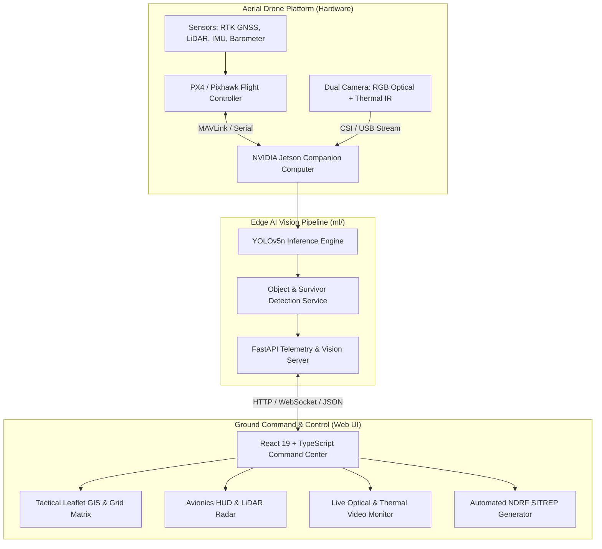
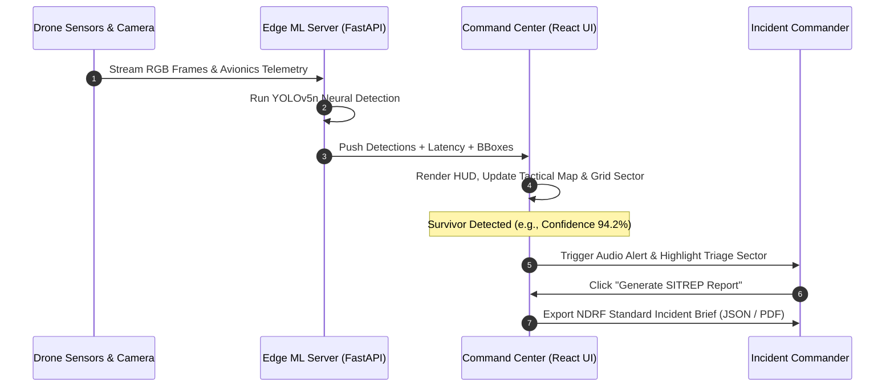

# 🏗️ SankatSathi - System Architecture & Engineering Design

This document details the architectural blueprint of **SankatSathi (संकटसाथी)**, covering hardware-software partitioning, data flow pipelines, fail-safe mechanisms, and software component interactions.

---

## 1. High-Level System Architecture

---

## 2. Component Breakdown

### 2.1 Flight Controller Layer (PX4 Autopilot)
- **Primary Responsibility**: Low-level motor control, orientation stabilization (gyro/accel EKF2 filter), waypoint navigation, and safety failsafes (Low Battery RTL, Geo-fence breach).
- **Decoupled Architecture**: Even if the edge AI companion computer experiences an unexpected freeze or reset, the flight controller independently maintains stable flight and RTL capability.

### 2.2 Edge AI Vision & Telemetry Engine (`ml/`)
- **Modules**:
  - `model_engine.py`: Encapsulates YOLOv5n neural network loading on CUDA or CPU, handles PIL/Base64 pre-processing, non-maximum suppression (NMS), and maps raw classes into tactical rescue designations.
  - `server.py`: FastAPI web service exposing REST endpoints for health checks, batch imagery inference, and live stream frame processing.

### 2.3 Ground Control Web Interface (`src/`)
- **Modules**:
  - `context/DroneContext.tsx`: Centralized reactive state store managing drone telemetry, waypoints, search sectors, survivor triage entries, active hazard zones, and SIH simulation sequences.
  - `components/Map/`: Tactical GIS mapping utilizing Leaflet with custom dark styling, heading vector rotation, survivor pins, hazard polygon geometry, and grid coverage trackers.
  - `components/Telemetry/`: Canvas HUD gauges, artificial horizon, vertical speed indicators, battery metrics, and LiDAR obstacle proximity warnings.
  - `components/VideoFeed/`: Simulated video streaming with synchronized YOLO bounding box overlays and thermal color lookup table filters.
  - `components/SITREP/`: Instant disaster incident reports with PDF and JSON export triggers.
  - `services/aiDetectionService.ts`: Client API layer communicating with `ml/server.py` at `http://127.0.0.1:8000`.

---

## 3. Data Flow & Communication Lifecycle

---

## 4. Disaster Triage & Hazard Mapping Taxonomy

| Category | Tactical Visual | Alert Priority | Recommended Field Action |
|---|---|---|---|
| **Survivor Confirmed** | 🟢 Emerald Pin | Critical (P1) | Immediate rescue squad dispatch via verified corridor. |
| **High Voltage 11kV** | ⚡ Amber Pulsing Line | High (P2) | Mark 15m safety exclusion zone for ground teams. |
| **Active Fire Hazard** | 🔥 Red Gradient Fill | High (P2) | Coordinate aerial fire suppression or buffer routing. |
| **Structural Collapse** | 🛑 Striped Hazard Polygon | Medium (P3) | Deploy acoustic search probes and canine units. |
